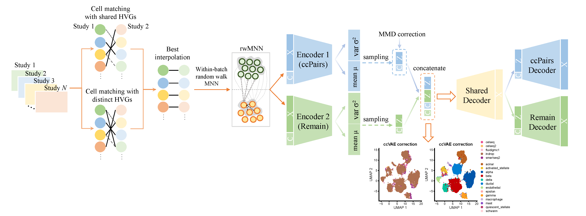

# ccVAE: A **c**ell-**c**ell paired **V**ariational **A**uto**E**ncoder for batch effect correction.


  ccVAE model initiates by matching cells pairwise using shared features from different datasets. After preprocessing and obtaining highly variable genes, singular value decomposition is applied to create a distance matrix. Initial pairings are determined through a linear assignment process to minimize distances. Both datasets are then aligned, and shared and unique gene features are projected into a common subspace. A refined matching is established using canonical correlation analysis and optimized via linear assignment. To improve subtype classification, Mutually Nearest Neighbors pairs are extracted, and random walks are used to include additional pairs. Following this, the data is split into cell-cell pairs and remaining cells, which are input into a CVAE model for batch effect correction. The joint posterior distribution is calculated through concatenation, and separate encoders and decoders are used for "ccPairs" and "remain" objects. The objective function integrates the likelihood and Kullback-Leibler divergence (KL). To enhance integration across datasets, the Maximum Mean Discrepancy loss is employed. After obtaining joint latent variables Z, Z is input into a shared decoder, which reintroduces variations across datasets to derive dataset-specific representations. The overall ccVAE loss includes the KL loss, reconstruction loss of "ccPairs" and "remain" objects and MMD loss. 

## Installation

Git clone and use `ccVAE` :

```
git clone https://github.com/zhou-1314/ccVAE.git
cd ccVAE
```

ccVAE is implemented in [Pytorch](https://pytorch.org/) framework. 

Note: we will consider uploading ccVAE algorithm into `pypi` in the future.

## Vignettes

Example 1: Batch effect correction of simulated datasets using ccVAE [here](https://github.com/zhou-1314/ccVAE/blob/master/tutorials/01.run_ccVAE-simulationData.ipynb).

Example 2: Batch effect correction of real Human Pancreas Dataset using ccVAE [here](https://github.com/zhou-1314/ccVAE/blob/master/tutorials/02.run_ccVAE_panc8_all.ipynb).

Example 3: Cell-cell mapping with ccVAE on real dataset [here](https://github.com/zhou-1314/ccVAE/blob/master/tutorials/03.BM_thymus_mapping_with_ccVAE.ipynb).


## Support
Please submit issues or reach out to zhouwg1314@gmail.com.

## Acknowledgment

ccVAE uses and/or references the following libraries and packages:

- [Mario](https://github.com/shuxiaoc/mario-py)

- [scArches](https://github.com/theislab/scarches/tree/51a0294ca987dabffb6d109178e0f69a90f9c24f)

Thanks for all their contributors and maintainers!

## Citation
If you have used ccVAE for your work, please consider citing:
```bibtex
@misc{2024ccVAE,
    title={ccVAE: A cell-cell paired Variational Auto Encoder for batch effect correction},
    author={Weige Zhou},
    howpublished = {\url{https://github.com/zhou-1314/ccVAE}},
    year={2024}
}
```

